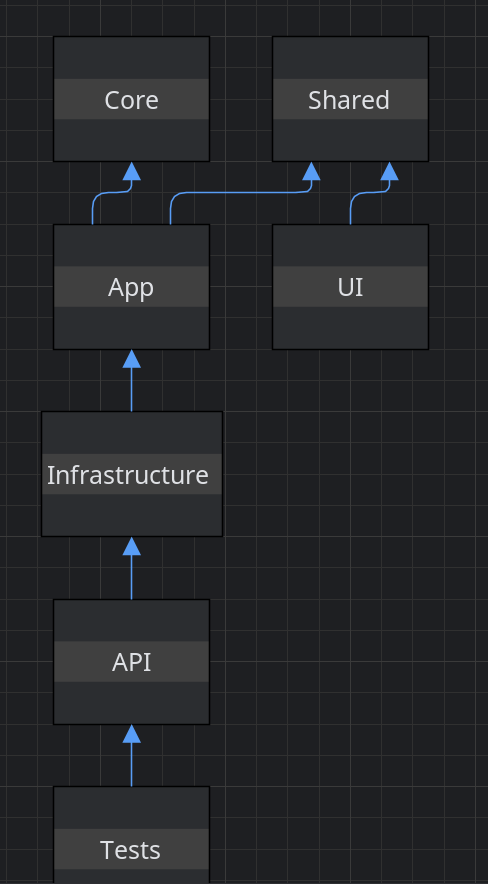
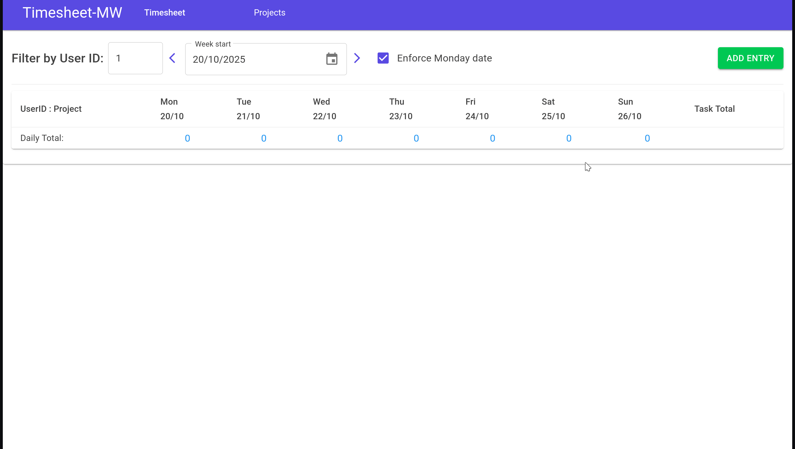
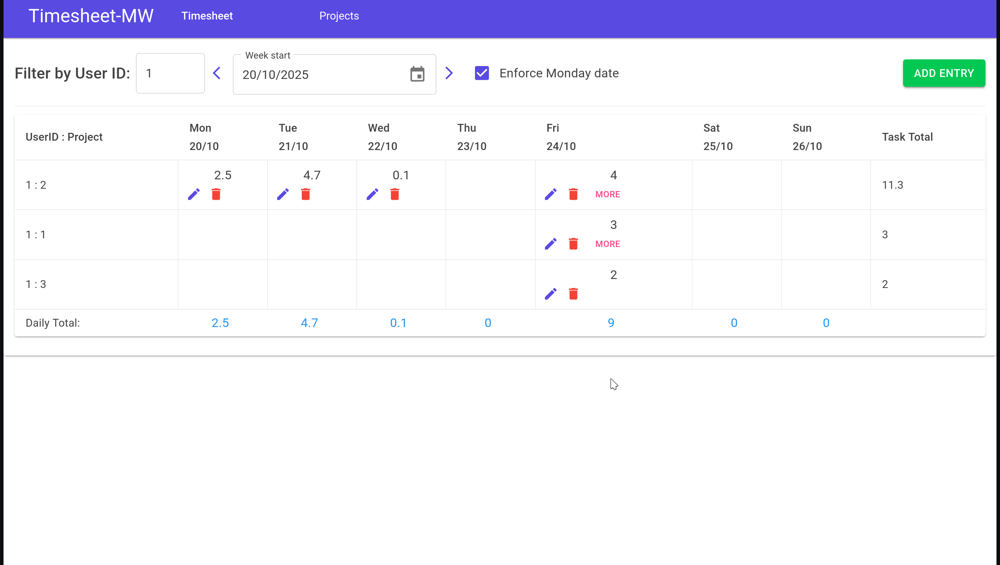
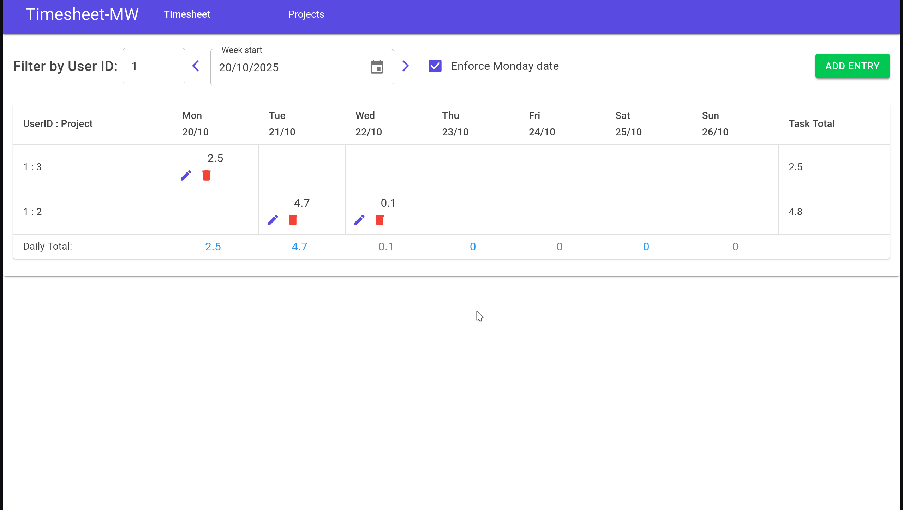
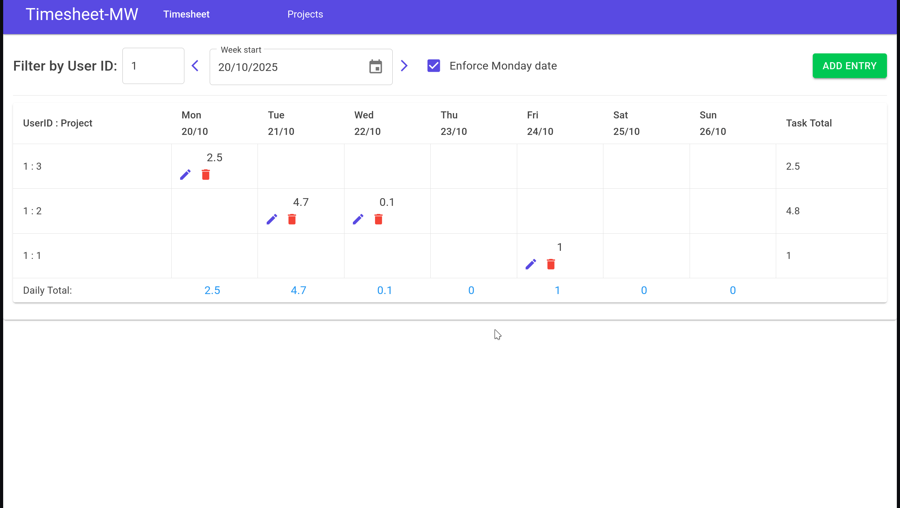

# Timesheet

A cleanly architected **Timesheet** application built with **.NET 9**, **Blazor WebAssembly**, and **Docker** — designed to be simple to understand, easy to extend, and pleasant to review.


---

## TL;DR

```bash
# One-command run (Docker)
docker compose up -d

# API
http://localhost:5599/swagger

# UI
http://localhost:5600
```

---

## 🧱 Architecture

The solution follows a pragmatic **Clean Architecture** approach — designed for scalability, testability, and maintainability.



### 🔄 Request Flow

A typical user interaction flows through the following layers:

```
UI → AppService → DataService → API → App (business logic) → Infra → Repository
```

This flow highlights the separation between presentation, application logic, and data access.

---

## ✨ Features

- CRUD timesheet entries with **domain rules**
- View and filter weekly entries by user
- View **total hours per project** per week
- Optionally Force **Monday** week start.
- Fully **in-memory** backend for simplicity
- **Blazor WASM** front‑end + **.NET 9 REST API**
- **Global exception middleware** with `problem+json` responses
- **FluentValidation** for input validation
- **Mapster** for fast object mapping
- **Unit tests** for Core, Infra, and API layers
- **Dockerized + CI/CD** deployment to GHCR

---

## 🧰 Project Structure

```
Src/
  Timesheet.Core/            # Domain models, interfaces, domain exceptions
  Timesheet.App/             # Business services, Mapster config, FluentValidation
  Timesheet.Infra/           # In-memory repo, DI extensions, Swagger helpers
  Timesheet.API/             # Controllers, middleware, startup
  Timesheet.UI/              # Blazor WASM (MudBlazor)
Timesheet.Shared/            # Contracts (requests/responses/queries) shared by App & UI
Tests/                       # Unit tests (services, repos, controllers)
docker-compose.yaml
```

---

## 🧠 Domain Rules

- A single day can contain **no more than 12 hours** total
- Entries **cannot** be added for **future dates**
- Entries **cannot** be older than **14 days**
- **Duplicate** entries for the same `(UserId, ProjectId, Date)` are not allowed

> Violations raise domain exceptions handled gracefully by the middleware.

---

## 🖥️ UI Preview

**Add Entry**  


**Edit / Delete Entry**  


**Filters & Projects View**  


**Validation on Both Sides**  


---

## 🔌 API Overview

- **Base**: `/api/Timesheet`
- **OpenAPI**: `/openapi/v1.json`
- **Swagger UI**: `/swagger`

### Endpoints

| Method | Route | Description |
|-------:|:------|:-------------|
| `POST` | `/api/Timesheet` | Add a new timesheet entry |
| `PUT`  | `/api/Timesheet/{id}` | Update an existing entry |
| `DELETE` | `/api/Timesheet/{id}` | Delete by id |
| `GET` | `/api/Timesheet/week?userId=&startDate=` | List entries for a user/week |
| `GET` | `/api/Timesheet/project-totals?userId=&startDate=` | Totals per project for a user/week |

### Example Request

```bash
curl -X POST http://localhost:5599/api/Timesheet   -H "Content-Type: application/json"   -d '{
    "userId": 1,
    "projectId": 42,
    "date": "2025-10-20",
    "hours": 7.5,
    "description": "Feature work"
  }'
```

### Example Error (`problem+json`)

```json
{
  "type": "https://httpstatuses.com/400",
  "title": "Validation failed.",
  "status": 400,
  "code": "Timesheet.ValidationFailed",
  "traceId": "00-...",
  "details": {
    "errors": {
      "Hours": ["Hours must be between 0.1 and 12."]
    }
  }
}
```

---

## 🚀 Running the App

### Docker (Recommended)

```bash
docker compose up -d
# API : http://localhost:5599 (Swagger: /swagger)
# UI  : http://localhost:5600
```

### Local Development

```bash
dotnet build
dotnet test
dotnet run --project Src/Timesheet.API
# or to run UI
cd Src/Timesheet.UI && dotnet run
```

> The UI reads `ApiUrl` from configuration; in Docker it defaults to `http://api:8080`.

---

## ⚙️ Configuration (LOCAL DEV ONLY) docker version is handled by nginx and containers network.

| Variable | Where | Purpose | Default |
|---|---|---|---|
| `ApiUrl` | UI wwwroot/appsettings.json | Base API URL used by Blazor | `http://api:8080` |
| Ports | docker-compose | Local mappings | API `5599:8080`, UI `5600:80` |

---

## 🧪 Testing

- **Core/App:** Domain rules (max hours/day, duplicates, missing entries)
- **Infra:** Repository operations (add/update/delete/range)
- **API:** Controller tests for Add/Update/Delete/Week/Totals

```bash
dotnet test
```

Test coverage focuses on correctness and business logic, not UI automation.

---

## 🧩 CI/CD Pipeline Overview

```
Push to master → GitHub Actions → Build/Test → Docker Build → Publish to GHCR → Deploy via Compose
```

Each step ensures the solution builds, tests, and ships as production-ready containers.

**Published images:**  
- `ghcr.io/hb-mw/timesheet-cmap-api:latest`  
- `ghcr.io/hb-mw/timesheet-cmap-ui:latest`

---

## 🧾 Development Summary

Built in approximately **20 hours** — balancing production realism with simplicity.  
Includes Dockerized builds, CI/CD integration, clean layering, structured validation, and proper domain-driven rules.

---

## ⚖️ Trade-offs & Future Enhancements

**Trade-offs**
- Slight setup overhead due to multiple projects
- Mapping introduces some duplication
- Shared contracts must stay version-aligned

**Potential improvements**
1. E2E testing for Blazor (Playwright)
2. Unified `ProblemDetails` format for all error types
3. Structured logging integration (Serilog/Graylog)
4. BDD-style tests for domain scenarios
5. Auto-generated client SDK via Swagger (NSwag/Refit)
6. Smaller Docker images (AOT publish)
7. Enhanced UI styling (MudBlazor customization)

---

## Code Review

— please edit **`code-review.md`** and open a PR for feedback.  
For direct contact: **mahmoud.wizzo@gmail.com**

---

## 📜 License

MIT © 2025 Mahmoud Wizzo
